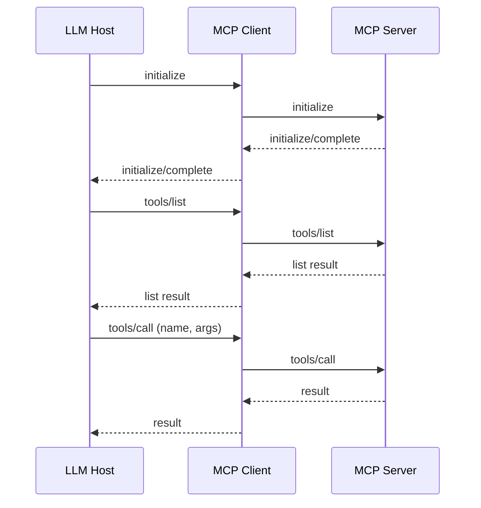

# 🛠️ MCP Quickstart

> MCP lets any LLM use real‑world tools in 3 lines of code—from browsing the web to querying databases, all with an open protocol.

**Connect any LLM to any MCP server — no proprietary client required**

Model Context Protocol (MCP) is a lightweight spec that lets large language models reach *outside* their training data by calling remote servers that expose tools such as browser automation, database queries, 3‑D renderers, and more.

---

## 📑 Table of Contents
- [🚀 Why MCP Matters](#why-mcp-matters)
- [🤖 What’s an Agent?](#whats-an-agent)
- [⚡ Quickstart Checklist](#quickstart-checklist-from-zero)
- [🧰 Why We Use mcp-use](#why-we-use-mcp-use)
- [🧩 Example Agents](#example-agents)
- [💡 Tips & Troubleshooting](#tips--troubleshooting)
- [📚 Common Commands](#common-commands)
- [🌐 Appendix — Protocols Primer](#appendix-understanding-protocols)
- [📡 Appendix — MCP Protocol Details](#appendix-mcp-protocol-details)
- [⚖️ License](#license)


---

## 🚀 Why MCP Matters

*MCP is “REST for AI tools” — where REST standardized **data exchange**, MCP standardizes **capability exchange**.*

Just as HTTP and REST transformed web development, MCP creates a standard way for AI models to discover and use real‑world tools:

1. **Vendor‑agnostic** – Any JSON‑emitting LLM can drive any MCP server  
2. **Safety & control** – Tool schemas make capabilities explicit; risky actions can be whitelisted or sandboxed  
3. **Composability** – Mix‑and‑match servers (browser + vector DB + email) just as REST let us compose micro‑services  

---

## 🤖 What's an Agent?

*An agent is a super‑smart assistant that can reason, choose a tool, and use it on your behalf.*

### The Agent Loop
1. **Listen** — reads your goal in plain language  
2. **Plan** — decides whether the answer needs outside information or action  
3. **Act** — if needed, picks the best tool (search engine, database, email‑sender, etc.) and calls it with the right inputs  
4. **Learn** — looks at the tool's reply and figures out what to do next  
5. **Respond** — once it has everything, explains the final answer back to you  

> 📎 **Analogy:**  
> Imagine asking a human assistant, “Book me a hotel in Paris under $200 a night.”  
> *They think* (compare options) → *use a browser* (look up hotels) → *read results* (price, location) → *decide* (which fits) → *reply* (the choice).  
> An MCP agent does the same loop, but lightning‑fast and with computer tools.

### 🛠️ Behind the Scenes (but simplified)

| Step | Under‑the‑hood action |
|------|----------------------|
| **Think** | The language model brainstorms possible next moves |
| **Tool‑Call** | It sends a short, structured request (JSON) to the chosen tool |
| **Observe** | Gets structured results back (numbers, URLs, text) |
| **Repeat or Finish** | Loops until it's confident enough to answer you |

No coding is required from you—the agent and MCP handle all the “plumbing,” so your only job is to *ask the question*.

---

## ⚡ Quickstart Checklist (from zero)

### 1  Start in a fresh terminal
```bash
mkdir mcp-quickstart
cd mcp-quickstart
```

### 2  Open the folder in Cursor *(optional)*
```bash
open -a "Cursor" .
```

### 3  Create & activate the virtual env *(repeat inside any new shell)*
```bash
python3 -m venv venv
source venv/bin/activate
```

### 4  Install dependencies
```bash
pip install mcp-use langchain-openai python-dotenv
```
*Need Anthropic, Groq, etc.?* Swap in `langchain-anthropic`, `langchain-groq`, …

### 5  Add your LLM API key in a .env file
```bash
echo "OPENAI_API_KEY=sk-..." > .env
```

### 6  Create **browser_mcp.json**
```json
{
  "mcpServers": {
    "playwright": {
      "command": "npx",
      "args": ["@playwright/mcp@latest"],
      "env": { "DISPLAY": ":1" }
    }
  }
}
```

### 7  Create **agent.py**
```python
import asyncio, os
from dotenv import load_dotenv
from langchain_openai import ChatOpenAI
from mcp_use import MCPClient, MCPAgent

load_dotenv()

async def main():
    client = MCPClient.from_config_file("browser_mcp.json")
    llm    = ChatOpenAI(model="gpt-4o")
    agent  = MCPAgent(llm=llm, client=client, max_steps=30)
    result = await agent.run("Find the best coffee shop in Brooklyn")
    print(result)

if __name__ == "__main__":
    asyncio.run(main())
```

### 8  Run the agent
```bash
python agent.py
```
⌛ First launch downloads the Playwright MCP server via **npx**, so it may take a minute.

Project tree should now look like:
```text
mcp-quickstart/
├── agent.py
├── browser_mcp.json
├── .env
└── venv/
```

---

## 🧰 Why We Use mcp-use

*A tiny Python toolkit that erases the boilerplate you'd normally write to talk to MCP servers.*

`mcp-use` is a plug‑and‑play **agent harness** that:

1. **Boots or attaches** to every MCP server you list (Playwright, Postgres, custom tools, …)  
2. **Fetches each tool's JSON schema** so the LLM sees a live catalog of capabilities  
3. **Keeps sessions alive**, meaning heavyweight resources (an open browser, a DB connection) persist across calls  
4. Exposes two high‑level classes:  
   * **MCPClient** – manages connections and routes calls  
   * **MCPAgent** – wraps your LLM and runs the classic *think → act → observe* loop for you  

### 🚀 Why It Feels “Serverless”

Everything runs **right inside your terminal** (or any Python script). There’s **no separate daemon** or hosted gateway—your process speaks directly to MCP servers over WebSocket/stdio.

```python
async def main():
    client = MCPClient.from_config_file("browser_mcp.json")
    llm    = ChatOpenAI(model="gpt-4o")
    agent  = MCPAgent(llm=llm, client=client)
    result = await agent.run("Find me ramen in Portland under $20")
    print(result)
```

### 🆚 How It Differs (in one breath)

Unlike heavyweight “agent platforms” that ship their *own* orchestration layer, **mcp-use stays minimal**: no extra protocol, no hosted runtime, no vendor lock‑in—just a thin Python wrapper around the open MCP spec.

---

## 🧩 Example Agents

| Agent | Purpose | MCP Servers Used |
| ----- | ------- | ---------------- |
| **Quick Restaurant Finder** | One‑liner demo that uses a Playwright browser to fetch “best restaurant” results for San Francisco | Playwright (browser automation) |
| **Airbnb Finder** | Surfaces top holiday rentals that meet price, amenity, and date constraints | Playwright (browser) + Airbnb MCP |
| **Restaurant Scout** | Ranks the best restaurants in any city via live Google search and review‑site scraping | Playwright (browser automation) |
| **Equity Screener** | Scrapes live fundamentals and returns growth/value/dividend shortlists on demand | Playwright (browser automation) |

---

## 💡 Tips & Troubleshooting

* **venv gotcha** – Opening a new terminal (or the built‑in one inside Cursor) starts a fresh shell, so re‑activate the venv with `source venv/bin/activate`. (Closing your terminal without deactivating does not break anything—just reactivate next time.)  
* **ModuleNotFoundError: fastembed** – Install with `pip install "mcp-use[search]"` or `pip install fastembed`  
* **Step limit** – Raise `max_steps` if your agent stops too early  
* **Safety filter** – Block risky tools by passing `disallowed_tools=[...]` to **MCPAgent**  

---

## 📚 Common Commands

* `pip install mcp-use` – unified MCP client library  
* `pip install "mcp-use[search]"` – pulls fastembed & tiny data files when you need semantic search tools  
* `pip install langchain-openai` – LangChain wrapper for OpenAI models  
* `python3 -m venv venv` – create **venv/**  
* `source venv/bin/activate` – enter the venv in the current shell  
* `deactivate` – leave the venv (closing the terminal also resets env‑vars)  

---

## 🌐 Appendix: Understanding Protocols

*A 90‑second refresher on why standard handshakes matter, from web pages to AI tools.*

### 📄 HTTP — the web's means of communication
* **What it is:** The **H**yper**T**ext **T**ransfer **P**rotocol  
* **What it solved:** Early browsers and servers spoke different dialects. HTTP standardized the rules—verbs such as **GET** and **POST**, status codes like **200 OK** or **404 Not Found**, headers that describe the payload—so *any* browser could fetch *any* page from *any* server  
* **Why it matters:** One common contract let developers build on a stable foundation instead of reinventing networking for every site  

### 🔄 RESTful APIs — a shared playbook for data
* **What it is:** Conventions layered *on top of* HTTP that map CRUD actions to HTTP verbs:  
  * **GET** → read  
  * **POST** → create  
  * **PUT/PATCH** → update  
  * **DELETE** → remove  
* **What it solved:** Web, mobile, and IoT apps could exchange structured data the *same predictable way*, unlocking speed and interoperability  

### 🤖 MCP — a protocol for agent super‑powers
* **What it is:** **M**odel **C**ontext **P**rotocol, a spec that standardizes how large‑language‑model (LLM) *agents* discover, call, and coordinate external tools—from a headless browser to a SQL database or 3‑D renderer  
* **What it solves:**  
  1. **Discovery** – Tools publish self‑describing JSON schemas, so the agent knows exactly which functions exist and what arguments they expect  
  2. **Transport** – A single bi‑directional channel (WebSocket or HTTP‑stream) carries both requests and responses, eliminating custom glue code  
  3. **Session state** – MCP keeps long‑running resources (e.g., an open browser tab) alive across calls, letting the LLM *think → act → observe* without constant re‑initialization  

---

## 📡 Appendix: MCP Protocol Details

*For developers who want to understand the protocol implementation details.*

### Transport & Envelope

| Layer | Technology | Why It's Used |
|-------|------------|---------------|
| **Wire** | JSON‑RPC 2.0 over **WebSocket**, **stdio**, or **SSE** | Gives request/response IDs, typed errors, and streaming without reinventing the wheel |
| **Session** | *Stateful* connection negotiated via initialize | Keeps resources (e.g., a browser tab) alive across many calls |

> **Handshake in two messages (client → server):**  
> 1️⃣ `initialize` — declares client name, version, supported transports  
> 2️⃣ `initialize/complete` ← server returns metadata + advertised features (tools, resources, prompts)  

### Tool Discovery
```json
// list available tools
{
  "jsonrpc": "2.0",
  "id": 42,
  "method": "tools/list"
}

// server response (truncated)
{
  "jsonrpc": "2.0",
  "id": 42,
  "result": {
    "tools": [{
      "name": "calculate_sum",
      "description": "Add two numbers together",
      "inputSchema": {
        "type": "object",
        "properties": {
          "a": { "type": "number" },
          "b": { "type": "number" }
        },
        "required": ["a", "b"]
      },
      "annotations": {
        "idempotentHint": true,
        "openWorldHint": false
      }
    }]
  }
}
```

### Tool Invocation
```json
// model decides to add 5 + 7
{
  "jsonrpc": "2.0",
  "id": 43,
  "method": "tools/call",
  "params": {
    "name": "calculate_sum",
    "arguments": { "a": 5, "b": 7 }
  }
},
{
  "jsonrpc": "2.0",
  "id": 43,
  "result": {
    "content": [{
      "type": "text",
      "text": "12"
    }]
  }
}
```
*The LLM reads “content,” sees “12,” and either continues planning or prints the final answer.*

### Call Flow Cheat‑Sheet


### Quick Recap
* **JSON‑RPC 2.0** keeps the wire format dead‑simple  
* **Tool schemas** make capabilities explicit & type‑safe  
* **Persistent sessions** avoid re‑spinning heavy resources  
* **Uniform prefixes** (`tools/`, `resources/`, `prompts/`) keep the mental model flat  

With these pieces, you can crack open any MCP message log and know exactly what's happening—and, more importantly, *why*.

---

## ⚖️ License

MIT – see LICENSE for details
